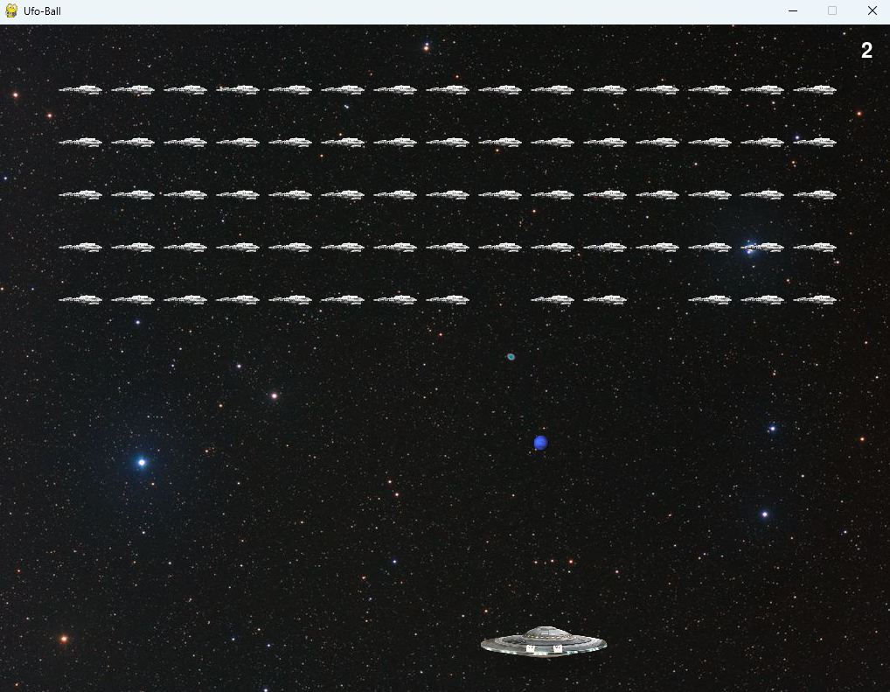

# My First Game - Ufo-Ball

This is my first game project developed using Python and Pygame.

## About the Game

My first game, Ufo-Ball, is a fun game where players control a spaceship to break blocks. Players move the spaceship and bounce the ball upwards to destroy the blocks. Each level becomes progressively harder, testing the player's skills.

## How to Play

Players use the arrow keys on the keyboard to move the spaceship left and right. Additionally, they must keep the ball up and hit the blocks below the spaceship. If the ball passes the bottom boundary, the player loses a life, and the game ends.

## Installation

To play the game, you'll need Python and the Pygame library. Follow these installation steps:

1. Download and install Python from [python.org](https://www.python.org/).
2. Install Pygame using pip: pip install pygame
3. Clone this repository to your computer or download it as a ZIP file.
4. Run the game by executing the "ufo_ball.py" file in the game's root directory

